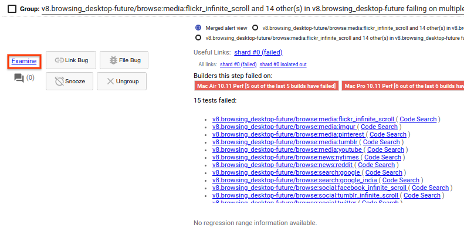
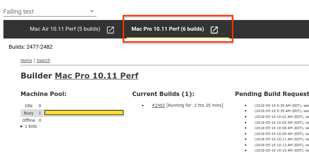
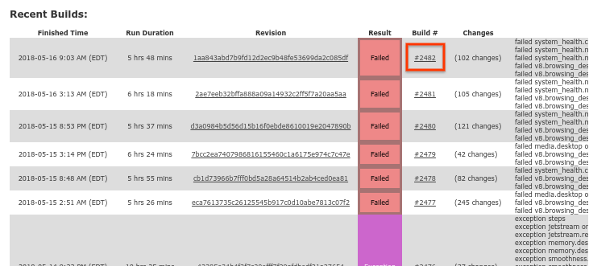
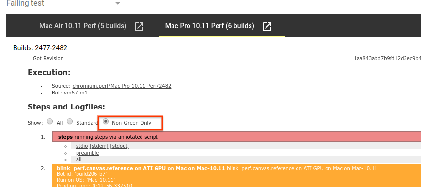
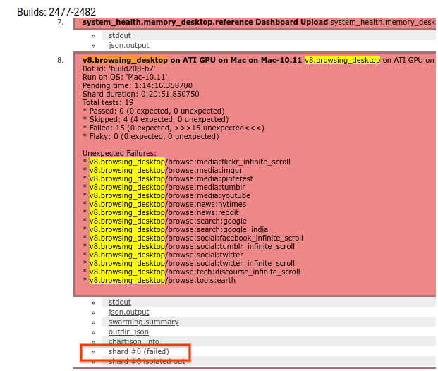
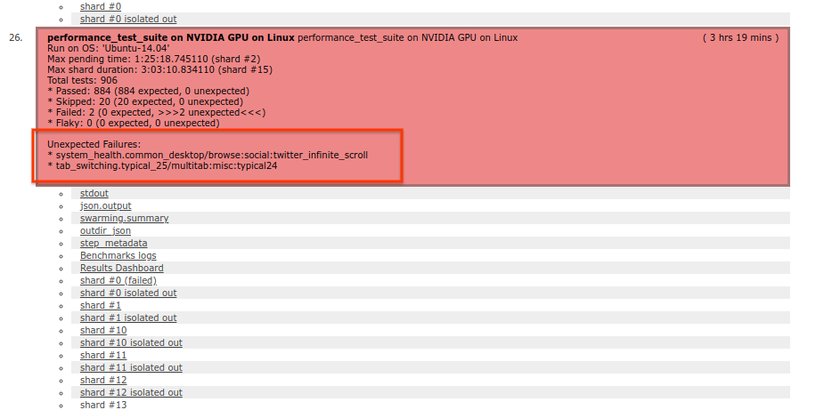
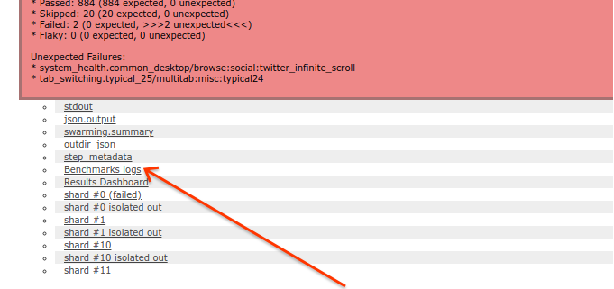

# How to access and navigate test logs

When trying to understand a failure, it can be useful to inspect the test logs where the failure occurred.

[TOC]

## Accessing test logs

### Accessing the log for the most recent failure

Usually, Sheriff-o-matic will include a link directly in the alert to the most recent instance of the test failure. Just click on "shard #0 (failed)".

### Accessing the logs for older failures

From the Sheriff-o-matic alert, click the "Examine" link to access a list of recent runs on the given bot.

If the failure spans multiple platforms, you can select which platform you care about from the top of the new pane.

This new pane shows all recent runs, not just runs where this benchmark failed, so it's often useful to use Ctrl+F and search for the failing benchmark name to highlight these runs.Next, click the build number for the run for which you want to access the logs. Once you've found the run you want the logs for, click the build number for the run for which you want to access the logs.

Once at the build page listing all steps, we need to find the test step that failed. Start by selecting to show "Non-Green Only" steps at the top of the page.

After doing this, search for your benchmark's name (in this case, "v8.browsing_desktop") until you find a step with a name like "<benchmark_name> on <platform>". Click the "shard #0 (failed)" link below that step to open the logs.

### Accessing the log for the new perf recipe

Currently linux-perf and mac-10_12_laptop_low_end-perf are running the new perf recipe and logs are accessed slightly differently. 

#### Failing Story Logs
Sheriff-o-matic now links to failing story logs when present.  Click on the logs
link to download the failing story log.

#### Failing Benchmark Logs
First navigate to the failing build through the Sheriff-o-matic entry by clicking on the builder this step failed on. 

This new screen will list out the most recent builds for this builder.  To identify which build you are interested in you will have to drill into each build starting with the most recent to identify where the specific failing test is. Ctrl-F for “performance_test_suite” or scroll down to the test entry.  The list of failed tests is right on the performance_test_suite step:

Once you have identified the build that has your failing test, click on the “Benchmark logs” link and Ctrl-F for your failing benchmark.  This link provides a logdog stream with all of the logs for that particular benchmark.

## Navigating log files

### Identifying why a story failed

The most common goal in opening a log file is to identify why a story failed.

To do this, search the logs for "`FAILED  ]`" (failed, space, space, right bracket) until you find the section in the middle of the logs in where your particular story ran. (Note that all failing story names will also be listed at the end of the logs, but this isn't what we want right now.)

Once at this location, scroll up until you find a call stack describing the failure that occurred.

### Identifying why a benchmark failed

Occasionally, a benchmark will fail in a way that prevents any stories from being run.

Generally, this means that the test log is very short. In order to find the call stack describing the failure, go to the bottom of the logs and scroll up until you find the failure.

### Getting a list of stories that failed

At the conclusion of the run, Telemetry lists all stories that failed. To find this list, search for "` FAILED TEST`" (space, failed, space, test). This should take you to a section that looks like this:

    [  PASSED  ] 58 tests.
    [  FAILED  ] 1 test, listed below:
    [  FAILED  ]  blink_perf.layout/subtree-detaching.html
    FAILED TEST

This section lists all failed stories.

